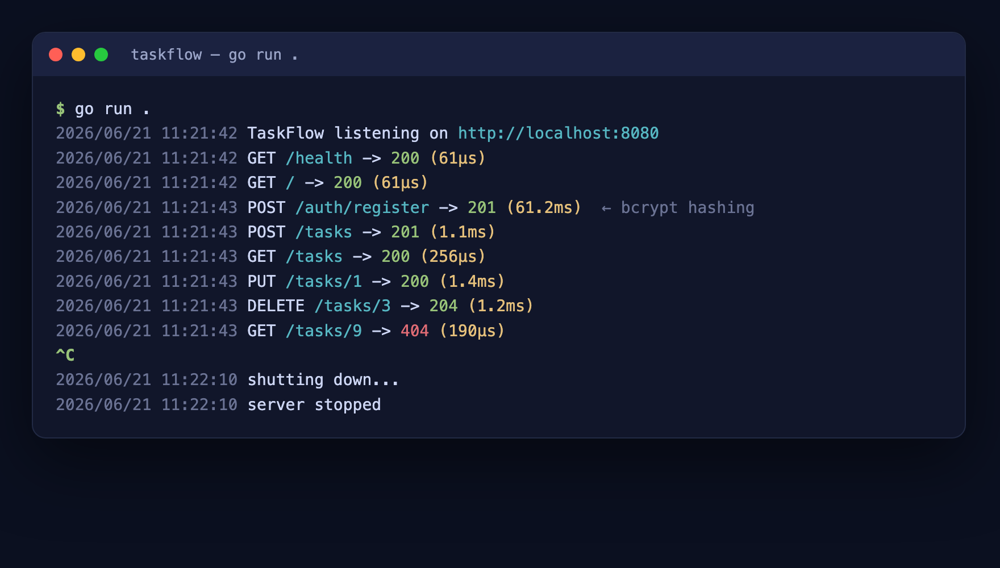
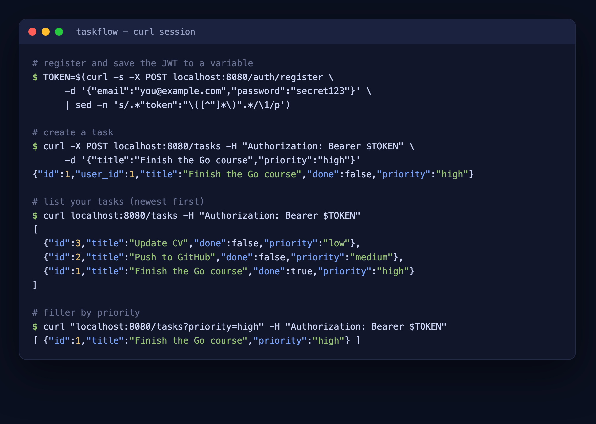
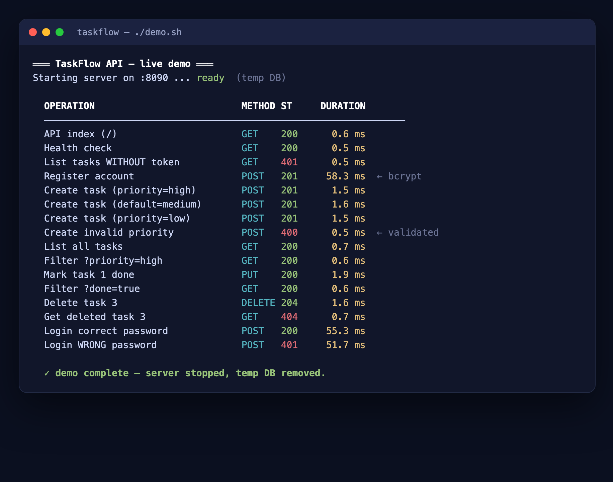

# 🚀 Getting Started with TaskFlow — Step by Step

A complete, copy-paste guide to running TaskFlow on your machine.

> 📸 **About the "screenshots":** TaskFlow is a backend API — it has no graphical
> window. So every screenshot below is a **real capture of the terminal**, which
> is exactly what you'll see on your screen when you run each command.

---

## ✅ Prerequisites

You only need **Go 1.22+** installed. Check it:

```console
$ go version
go version go1.25.5 darwin/amd64
```

> If that prints a version, you're ready. (No database to install — TaskFlow uses
> an embedded, pure-Go SQLite, so there's nothing else to set up.)

---

## Step 1 — Open a terminal in the project

```console
$ cd /Users/macbook/Desktop/golang/taskflow
```

You should see the project files:

```console
$ ls
Dockerfile      Makefile        README.md       demo.sh
GETTING_STARTED.md  RESUME.md   go.mod          go.sum
internal        main.go
```

---

## Step 2 — Run the tests (prove it works before running)

```console
$ go test ./...
?       taskflow                          [no test files]
ok      taskflow/internal/api             1.9s
?       taskflow/internal/auth            [no test files]
?       taskflow/internal/config          [no test files]
?       taskflow/internal/models          [no test files]
?       taskflow/internal/store           [no test files]
```

> `ok ... internal/api` means all the API tests pass (auth, CRUD, per-user
> isolation, validation, filters). The `[no test files]` lines are just packages
> without their own tests — not errors.

---

## Step 3 — Start the server

```console
$ go run .
2026/06/21 11:21:42 TaskFlow listening on http://localhost:8080
```

After you make some requests, the server logs each one with its **duration**:



> 🎉 The server is now running and **waiting for requests**. Leave this terminal
> open — it will print a log line for every request. To stop it later, press
> **Ctrl + C**.
>
> 💡 First run also creates a `taskflow.db` file (your database).

**Open a SECOND terminal** for the next steps (so the server keeps running in the first).

---

## Step 4 — Open it in your browser

Two endpoints are public and work directly in a browser. Open:

**http://localhost:8080/** — the API index

```json
{
    "service": "TaskFlow API",
    "version": "1.0",
    "endpoints": {
        "GET  /health": "liveness check (public)",
        "POST /auth/register": "create an account, returns a JWT (public)",
        "POST /auth/login": "log in, returns a JWT (public)",
        "GET  /tasks": "list your tasks; filters: ?done=, ?priority= (auth)",
        "POST /tasks": "create a task (auth)",
        "GET  /tasks/{id}": "get one task (auth)",
        "PUT  /tasks/{id}": "update a task (auth)",
        "DELETE /tasks/{id}": "delete a task (auth)"
    }
}
```

**http://localhost:8080/health** — liveness check

```json
{"status":"ok"}
```

> ℹ️ Opening any other path (like `/tasks`) in the browser returns
> `401 Unauthorized` or `404` — that's correct. Those need a login token, which
> the browser address bar can't send. Use the terminal below for those.

---

## Step 5 — Register an account (get your token)

In your second terminal:

```console
$ curl -X POST localhost:8080/auth/register \
    -d '{"email":"you@example.com","password":"secret123"}'
```

📸 What you'll see:

```json
{
  "token": "eyJhbGciOiJIUzI1NiIsInR5cCI6IkpXVCJ9.eyJzdWIiOiIxIiwiZXhw...",
  "user": {
    "id": 1,
    "email": "you@example.com",
    "created_at": "2026-06-21T07:51:43Z"
  }
}
```

> 🔑 That `token` is your **JWT** — proof of who you are. You send it on every
> task request. Notice the password is **never** in the response (it's hashed and
> hidden). Save the token to a variable so you don't have to copy it each time:

```console
$ TOKEN=$(curl -s -X POST localhost:8080/auth/register \
    -d '{"email":"you@example.com","password":"secret123"}' \
    | sed -n 's/.*"token":"\([^"]*\)".*/\1/p')
```

> (If you already registered that email, use `/auth/login` with the same body to
> get a fresh token instead.)

---

## Step 6 — Create some tasks

```console
$ curl -X POST localhost:8080/tasks \
    -H "Authorization: Bearer $TOKEN" \
    -d '{"title":"Finish the Go course","priority":"high"}'
```

📸 What you'll see:

```json
{"id":1,"user_id":1,"title":"Finish the Go course","done":false,"priority":"high","created_at":"2026-06-21T07:48:06Z"}
```

Create a couple more (priority defaults to `medium` if omitted):

```console
$ curl -X POST localhost:8080/tasks -H "Authorization: Bearer $TOKEN" -d '{"title":"Push to GitHub"}'
$ curl -X POST localhost:8080/tasks -H "Authorization: Bearer $TOKEN" -d '{"title":"Update CV","priority":"low"}'
```

> ⚠️ Try an invalid priority to see validation in action:
> ```console
> $ curl -X POST localhost:8080/tasks -H "Authorization: Bearer $TOKEN" -d '{"title":"x","priority":"urgent"}'
> {"error":"priority must be low, medium, or high"}
> ```

---

## Step 7 — List and filter your tasks

Here's a full register → create → list → filter session and what it looks like:



```console
$ curl localhost:8080/tasks -H "Authorization: Bearer $TOKEN"
```

📸 What you'll see (newest first):

```json
[
  {"id":3,"user_id":1,"title":"Update CV","done":false,"priority":"low","created_at":"2026-06-21T07:48:06Z"},
  {"id":2,"user_id":1,"title":"Push to GitHub","done":false,"priority":"medium","created_at":"2026-06-21T07:48:06Z"},
  {"id":1,"user_id":1,"title":"Finish the Go course","done":false,"priority":"high","created_at":"2026-06-21T07:48:06Z"}
]
```

Filter the list:

```console
$ curl "localhost:8080/tasks?priority=high" -H "Authorization: Bearer $TOKEN"
$ curl "localhost:8080/tasks?done=false"   -H "Authorization: Bearer $TOKEN"
$ curl "localhost:8080/tasks?priority=low&done=false" -H "Authorization: Bearer $TOKEN"
```

---

## Step 8 — Update and delete

Mark task 1 as done:

```console
$ curl -X PUT localhost:8080/tasks/1 \
    -H "Authorization: Bearer $TOKEN" \
    -d '{"title":"Finish the Go course","priority":"high","done":true}'
```

```json
{"id":1,"user_id":1,"title":"Finish the Go course","done":true,"priority":"high","created_at":"2026-06-21T07:48:06Z"}
```

Delete task 3 (returns `204 No Content` — an empty success):

```console
$ curl -i -X DELETE localhost:8080/tasks/3 -H "Authorization: Bearer $TOKEN"
HTTP/1.1 204 No Content
```

---

## Step 9 — Watch the server log (durations!)

Look back at your **first terminal** (the one running the server). Every request
you made was logged with its **duration**:

```console
2026/06/21 11:21:42 TaskFlow listening on http://localhost:8080
2026/06/21 11:21:42 GET /health -> 200 (61µs)
2026/06/21 11:21:42 GET / -> 200 (61µs)
2026/06/21 11:21:43 POST /auth/register -> 201 (61.2ms)   ← bcrypt hashing is slow on purpose
2026/06/21 11:21:43 POST /tasks -> 201 (1.1ms)
2026/06/21 11:21:43 GET /tasks -> 200 (256µs)
```

> 🔎 Notice: registration/login take ~60ms (bcrypt password hashing), while task
> operations take ~1ms or less. That contrast is a real talking point in interviews.

---

## Step 10 — Stop the server

In the first terminal, press **Ctrl + C**. You'll see a clean shutdown:

```console
^C
2026/06/21 11:22:10 shutting down...
2026/06/21 11:22:10 server stopped
```

---

## ⭐ Bonus — the one-command demo

Don't want to type all those curls? One script does the **entire** flow and shows
every operation with its duration:

```console
$ ./demo.sh
```

or

```console
$ make demo
```

📸 What you'll see:



```console
═══ TaskFlow API — live demo ═══
Starting server on :8090 ...
ready  (temp DB: /tmp/taskflow_demo.XXXX.db)

  OPERATION                          METHOD ST     DURATION
  ────────────────────────────────────────────────────────────────
  API index (/)                      GET    200      0.6 ms
  Health check                       GET    200      0.5 ms
  List tasks WITHOUT token (401)     GET    401      0.5 ms
  Register account                   POST   201     58.3 ms
  Create task (priority=high)        POST   201      1.5 ms
  Create task (default=medium)       POST   201      1.6 ms
  Create invalid priority (400)      POST   400      0.5 ms
  List all tasks                     GET    200      0.7 ms
  Filter ?priority=high              GET    200      0.6 ms
  Mark task 1 done                   PUT    200      1.9 ms
  Filter ?done=true                  GET    200      0.6 ms
  Delete task 3 (204)                DELETE 204      1.6 ms
  Login correct password             POST   200     55.3 ms
  Login WRONG password (401)         POST   401     51.7 ms

  ✓ demo complete — server stopped, temp DB removed.
```

The script starts its own server, runs everything, prints the data changes and
the server log, then cleans up after itself.

---

## 🛠️ Handy `make` commands

```console
$ make help        # list all commands
$ make run         # run the server
$ make demo        # run the CLI demo above
$ make test        # run tests
$ make cover       # tests + coverage %
$ make build       # compile a ./taskflow binary
```

---

## 🐳 Optional — run it in Docker

(Requires internet the first time, to pull the base image.)

```console
$ docker build -t taskflow .
$ docker run --rm -p 8080:8080 -e TASKFLOW_JWT_SECRET=change-me taskflow
```

Then use the same `curl` commands against `localhost:8080`.

---

## ❓ Troubleshooting

| Problem | Fix |
|---------|-----|
| `bind: address already in use` | Another server is on port 8080. Free it: `lsof -ti:8080 \| xargs kill -9` — or run on another port: `TASKFLOW_ADDR=:8081 go run .` |
| `401` on `/tasks` | You didn't send the token. Add `-H "Authorization: Bearer $TOKEN"`. |
| `404` at `/tasks/...` | That task id doesn't exist (or isn't yours). |
| Browser shows 404 at a path | Normal — only `/` and `/health` are browser-friendly; the rest need a token. |
| Token expired | Tokens last 24h. Log in again via `POST /auth/login`. |

---

Happy hacking! For the full API reference see [README.md](README.md), and for
interview talking points see [RESUME.md](RESUME.md).
